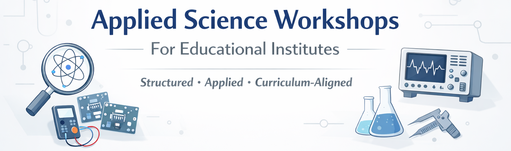

# Applied Science Workshops for Educational Institutes

---

## Overview

Applied Science Workshops for Educational Institutes is a structured hands-on learning initiative designed to complement classroom education through guided experimentation and observation-based learning.

The program is suitable for:

- Schools (Middle & Senior Secondary)
- Higher Secondary Institutions
- Colleges offering science and technical streams

The workshops are conducted in a classroom-friendly format and are aligned with curriculum objectives. The focus is on strengthening conceptual clarity, practical exposure, and analytical thinking through structured engagement.

The initiative emphasizes experiential learning within safe and supervised academic settings.

---

## Program Snapshot – At a Glance

**Target Institutions:**  
Schools (Classes 6–12) and Colleges  

**Session Duration:**  
2–3 Hours (Customizable)

**Batch Size:**  
20–40 Students (Recommended)

**Delivery Mode:**  
Classroom / Laboratory-Based  

**Infrastructure Requirement:**  
Utilizes Existing Institutional Facilities  

**Pilot Option Available:**  
Institutions may begin with a single pilot session before extended planning  

---

## Program Foundation

Each session follows a structured learning sequence:

**Concept → Demonstration → Guided Observation → Application Discussion → Documentation**

This ensures:

- Active participation  
- Academic alignment  
- Measured and disciplined learning  
- Conceptual reinforcement  

The workshops are designed to enhance, not replace, formal teaching.

---

## Core Focus Areas

### 1. Applied Science & Conceptual Experimentation  
Guided practical sessions that reinforce scientific principles through structured demonstrations and analytical discussion.

### 2. Measurement & Instrumentation Fundamentals  
Introduction to measurement systems and observation-based reasoning aligned with academic curriculum.

### 3. Innovation & Structured Problem-Solving  
Encouraging logical thinking and practical scientific reasoning through guided activities.

### 4. System Thinking & Application Awareness  
Understanding how scientific principles connect to real-world systems and structured implementation.

### 5. Process Discipline & Production Orientation  
Introducing students to step-by-step system development, responsible material handling, and awareness of how scientific concepts translate into organized production and applied environments.

---

## Structured Level Framework

### Foundation Level (Middle School)

Focus:
- Observation skills  
- Measurement awareness  
- Cause-and-effect reasoning  

Objective:
To cultivate curiosity and structured scientific thinking.

---

### Applied Learning Level (High School)

Focus:
- Interpreting measurements  
- Analytical reasoning  
- Structured experimentation  

Objective:
To strengthen applied conceptual clarity.

---

### Advanced Concept Level (Senior Secondary / College)

Focus:
- Multi-step experiments  
- System-level understanding  
- Practical discussions  

Objective:
To support students preparing for higher academic pathways.

---

## 4-Tier Program Classification Framework

### Tier 1 – Syllabus-Aligned Core Sessions
Curriculum reinforcement through guided demonstrations and discussions.

### Tier 2 – Skill-Building Applied Modules
Structured hands-on engagement with observation and reasoning.

### Tier 3 – Demonstration & System Understanding Modules
Interactive system-level exposure and measurement interpretation.

### Tier 4 – Advanced Analytical Modules
Higher-level conceptual and applied engagement for senior students.

---

## Educational Outcomes

Students are expected to:

- Improve conceptual clarity  
- Develop disciplined observation habits  
- Understand measurement importance  
- Gain confidence in scientific discussions  
- Connect theory with real-world application  

---

## Safety & Supervision

All sessions are conducted under guided supervision with structured and age-appropriate activities.

Student safety and institutional coordination remain central priorities.

---

## Engagement Model

1. Initial academic discussion  
2. Module selection  
3. Scheduling  
4. Workshop delivery  
5. Optional feedback session  
The program is implemented in a controlled, batch-oriented format to ensure quality delivery, close supervision, and structured academic engagement.

---

## About the Facilitator

Amit Mishra is an engineering professional with experience across applied technical environments, structured training programs, and production-oriented systems.

His professional exposure includes:

- Embedded systems training and practical electronics  
- Measurement and instrumentation-based applications  
- System-level understanding of hardware environments  
- Industrial exposure to structured workflows and process discipline  
- Participation in technology-driven and manufacturing-oriented settings  

In addition to technical industry exposure, he has academic teaching experience supporting students preparing for competitive examinations such as:

- IIT-JEE  
- NEET  
- GATE  

His approach to applied science education emphasizes:

- Conceptual clarity before implementation  
- Observation-based reasoning  
- Measurement-driven understanding  
- Structured documentation habits  
- Safe and supervised engagement  
- Gradual progression of complexity  

The workshops are designed with a focus on disciplined execution rather than rapid model completion. Emphasis is placed on understanding processes, interpreting results, and maintaining academic alignment.

The initiative operates under a framework of:

- Technical integrity  
- Institutional respect  
- Controlled scalability  
- Documentation-driven methodology  

---

## Long-Term Vision

The long-term vision of Applied Science Workshops for Educational Institutes is to contribute meaningfully to structured, hands-on scientific engagement within academic environments.

The initiative seeks to gradually develop a scalable and institution-aligned framework that strengthens applied understanding without disrupting existing curriculum systems.

The long-term objectives include:

- Supporting schools and colleges in integrating structured experimental exposure alongside theoretical instruction  
- Encouraging measurement-based reasoning and disciplined scientific observation  
- Promoting confidence in handling scientific tools, instruments, and structured processes  
- Cultivating system-level thinking at an age-appropriate level  
- Developing modular workshop formats that can be replicated across institutions  

Over time, the initiative envisions:

- Expansion of structured module libraries  
- Development of standardized documentation templates  
- Creation of progressively advanced workshop tracks  
- Establishment of dedicated laboratory environments (subject to institutional collaboration)  
- Structured instructor training models for controlled scalability  

The growth philosophy remains gradual and quality-driven rather than volume-driven.

The focus is on:

- Technical integrity  
- Institutional respect  
- Safety-first implementation  
- Transparent academic alignment  
- Sustainable operational development  

The initiative does not aim to replace formal education systems. Instead, it aspires to function as a complementary applied learning platform that strengthens conceptual clarity, structured thinking, and responsible technical engagement among students.

Through disciplined execution, academic collaboration, and continuous refinement, the long-term vision is to contribute to a culture of structured scientific curiosity and applied understanding within educational institutions.

